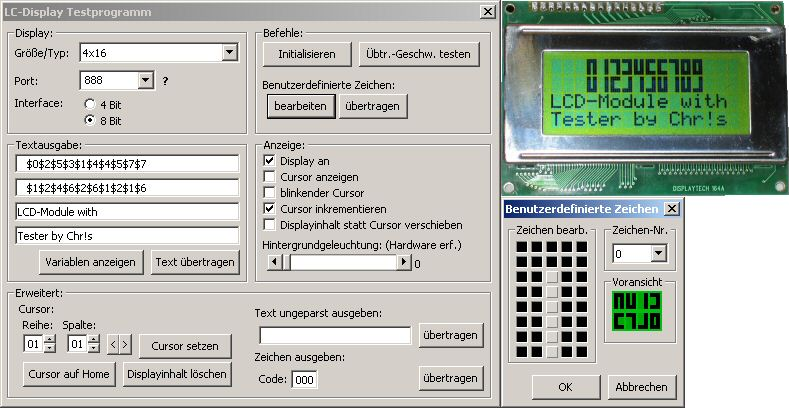



## Control Character LCD\-Modules \(ie\. HD44780\) connected to the Parallel Port \- fully commented\(german\)

### Description

Rather big library for controlling textbased LCD-Modules with HD44780 (or compatible) controller.

Nearly all features of the controller are supported!

See it for yourself!
 
### More Info
 

             |
---                |---
**Submitted On**   |2004-10-29 23:05:38
**By**             |[Chr\!s](https://github.com/Planet-Source-Code/PSCIndex/blob/master/ByAuthor/chr-s.md)
**Level**          |Intermediate
**User Rating**    |4.4 (31 globes from 7 users)
**Compatibility**  |VB 6\.0
**Category**       |[Libraries](https://github.com/Planet-Source-Code/PSCIndex/blob/master/ByCategory/libraries__1-49.md)
**World**          |[Visual Basic](https://github.com/Planet-Source-Code/PSCIndex/blob/master/ByWorld/visual-basic.md)
**Archive File**   |[Control\_Ch1812681112004\.zip](https://github.com/Planet-Source-Code/chr-s-control-character-lcd-modules-ie-hd44780-connected-to-the-parallel-port-fully-commen__1-57030/archive/master.zip)

